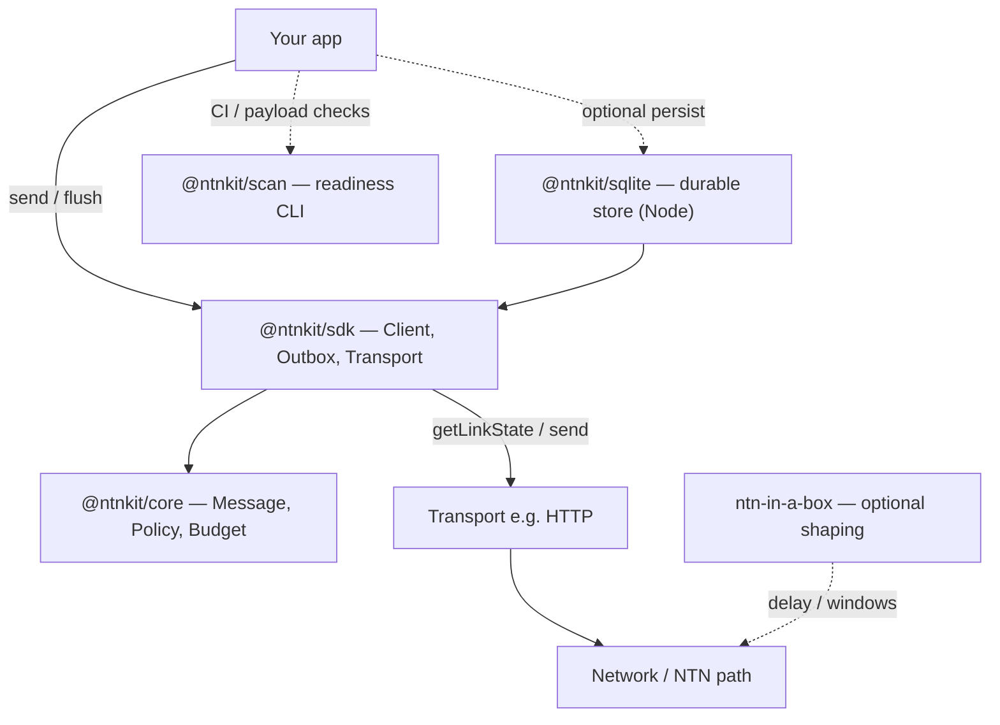
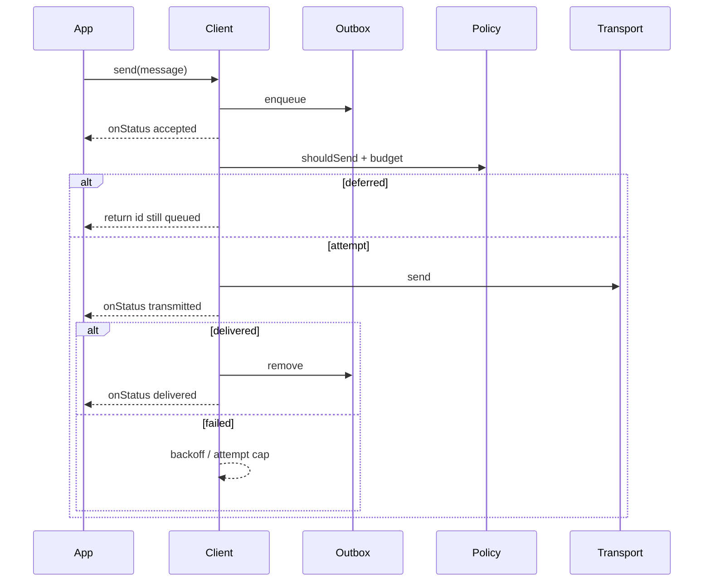
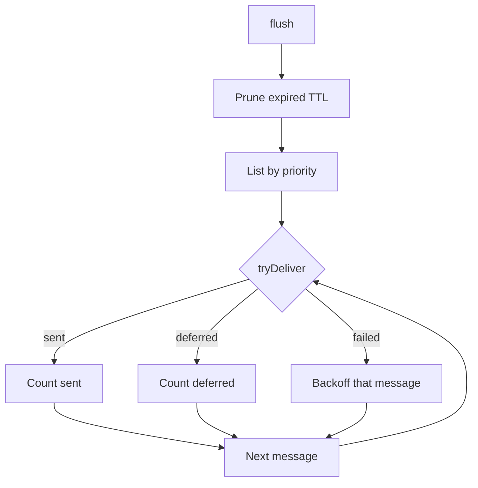

# ntnkit

**Satellite-ready application layer** for intermittent and constrained networks (3GPP NTN / NTN-IoT, hybrid cellular+satellite, Android D2D-style apps).

Modems and network sandboxes get bits on the air. Apps still need to decide *when* to send, *how much* airtime they can afford, *what* goes first, and *how* to survive a closed window without retry storms. **ntnkit** is that layer: store-and-forward outbox, priority, TTL, byte budgets, and pass-aware send policy — with local CI against [ntn-in-a-box](https://github.com/hyavari/ntn-in-a-box).

```
Your app  →  @ntnkit/sdk (queue + policy)  →  Transport (HTTP/…)  →  Network
                      ↑
              @ntnkit/core (rules)
                      ↑
              @ntnkit/scan (readiness)
```

## Why

| Without ntnkit | With ntnkit |
|----------------|-------------|
| App retries blindly when RTT spikes or the pass ends | Attempt caps + full-jitter backoff per window |
| Every sample goes out immediately | Priority queue + daily byte budget |
| “Network up” ≠ “safe to send on NTN” | `NextWindow` / link-state aware delivery modes |
| Hard to test without operator access | Profiles + examples under ntn-in-a-box |

ntnkit does **not** simulate the radio (use ntn-in-a-box), drive a modem SDK, or implement DTN/BPv7. It makes *your application* behave correctly on top of those paths.

## Architecture



| Package | Role |
|---------|------|
| [`@ntnkit/core`](packages/core) | Pure logic: message model, `shouldSend`, backoff, `ByteBudget` |
| [`@ntnkit/sdk`](packages/sdk) | `connect()` client, outbox, pluggable `Transport`, `httpTransport`, `ntnboxLinkState` |
| [`@ntnkit/sqlite`](packages/sqlite) | Node SQLite durable outbox + budget/attempt persistence (`openSqliteStore`) |
| [`@ntnkit/scan`](packages/scan) | Static readiness rules + `ntnkit-scan` CLI for CI |

**Design rules (v1):** tiny payloads by default; async-first (no sub-second RTT assumption); hybrid terrestrial + NTN; pluggable transports (core never imports modem SDKs); testable under ntn-in-a-box profiles.

## Flows

### Send (store-and-forward)

Every `send` **enqueues first**, then attempts delivery. Fast-path success still briefly lands in the outbox, then is removed on deliver. `onStatus` runs after the client lock releases.



### Flush (drain the outbox)

Call `flush()` when a satellite window opens (or on a timer / link-change hook). Order: **Critical → High → Normal → Low**, oldest first within a tier. A transport failure does **not** abort the rest of the batch.



### Delivery stages (`onStatus`)

| Stage | Meaning |
|-------|---------|
| `accepted` | Persisted in the outbox |
| `transmitted` | Transport returned (not emitted if it throws) |
| `delivered` | Remote success; removed from outbox |
| `expired` | Dropped on `send`/`flush` because TTL elapsed |

Handlers run **after** the client lock releases. Async work is not awaited; sync throws and rejected promises are swallowed.

## Quick start

Requires **Node.js 24+** and [pnpm](https://pnpm.io) 10+ (this is a pnpm workspace — do not use `npm install` / `yarn`).

```bash
pnpm install
pnpm test
pnpm build
```

```ts
import { DeliveryMode, Priority } from "@ntnkit/core";
import { connect, httpTransport } from "@ntnkit/sdk";

const client = await connect({
  budget: { dailyBytes: 50_000 },
  // https:// for production; http:// fine for localhost / CI
  transport: httpTransport({ url: "https://example.com/ingest" }),
  onStatus: ({ id, stage }) => console.log(id, stage),
});

await client.send({
  payload: new TextEncoder().encode('{"ok":true}'),
  priority: Priority.Normal,
  delivery: DeliveryMode.Immediate,
  dedupKey: "heartbeat-1",
  contentType: "application/json",
});

// When a pass opens (or your link hook fires):
await client.flush();
await client.close();
```

Durable outbox (Node):

```ts
import { connect, httpTransport } from "@ntnkit/sdk";
import { openSqliteStore } from "@ntnkit/sqlite";

const store = await openSqliteStore({ path: "./outbox.db" });
const client = await connect({
  store,
  transport: httpTransport({ url: "https://example.com/ingest" }),
});
```

### Examples

```bash
# Immediate delivery smoke test
pnpm --filter @ntnkit/example-ci-smoke start

# Queue, then flush when a satellite window opens
NTNKIT_SIMULATE_WINDOW=1 pnpm --filter @ntnkit/example-ci-smoke start

# Live HTTP against a local echo server
SMOKE_LIVE=1 pnpm --filter @ntnkit/example-ci-smoke start

# Messenger loop
pnpm --filter @ntnkit/example-messenger start
```

### With ntn-in-a-box

Run the smoke example under a short coverage-gap profile. The API must be
reachable from the shaped network namespace via the host veth gateway:

```bash
# From the ntn-in-a-box repo root
# Linux: native netns. macOS: Docker proxy (rebuild image once: make docker)
./ntnbox run --addr 0.0.0.0:18080 \
  --profile ../ntnkit/test/profiles/ci_gap.yaml -- \
  env NTNBOX_API_BASE=http://10.200.0.1:18080 \
  ../ntnkit/scripts/ntnbox-ci-smoke.sh
```

On macOS the Docker image provides Linux Node/pnpm and bind-mounts the
ntnkit tree (with a Linux `node_modules` volume). First run may install
deps inside that volume.

`NTNBOX_API_BASE` selects the real ntnbox link-state path (no
`NTNKIT_SIMULATE_WINDOW`). Keep `ci_gap.yaml` for local demos that must finish
under the default 120s smoke timeout.

### Scan a payload

```bash
pnpm --filter @ntnkit/scan exec ntnkit-scan --payload-file ./payload.bin [--max-bytes 1200] [--json]
```

Exit `0` = no critical findings, `1` = critical findings, `2` = usage/error.

## Behavior reference

- **Budget** — only `Priority.Critical` may overspend the daily byte budget. `WhenBudgetAllows` is strict (Critical waits too). Failed attempts count as airtime by default (`countFailedAttempts`).
- **Delivery modes**
  - `Immediate` — send when not offline
  - `NextWindow` — only when `linkState === satellite_window_open` (healthy terrestrial alone is not enough)
  - `WhenBudgetAllows` — link up and budget covers the payload
- **Retries** — attempt caps during `satellite_window_open`; full-jitter backoff; `flush()` continues after a single transport failure
- **Outbox** — one outbox per `connect()` client; call `close()` to release ownership. Default storage is **in-memory**. For process-crash survival on Node, pass `store: await openSqliteStore({ path })` from `@ntnkit/sqlite` (at-least-once; use `dedupKey` for idempotency). Budget day boundaries are UTC. SQLite stores are **single-writer** (one process) in v1.

## Repository layout

```
packages/
  core/     # types, policy, budget
  sdk/      # client, outbox, http transport, ntnbox link-state
  sqlite/   # Node durable outbox (better-sqlite3)
  scan/     # readiness CLI
examples/
  ci-smoke/
  messenger/
test/profiles/   # ntn-in-a-box style CI profiles
```

## Contributing

Contributions are welcome. See [CONTRIBUTING.md](CONTRIBUTING.md) for setup and PR expectations.

```bash
pnpm install
pnpm test
pnpm typecheck
pnpm lint
pnpm build
```

- Keep PRs focused; add tests for behavior you change
- `@ntnkit/core` should stay free of I/O
- Prefer extending the `Transport` / `Outbox` interfaces over special-casing the client

## License

[Apache-2.0](LICENSE)
